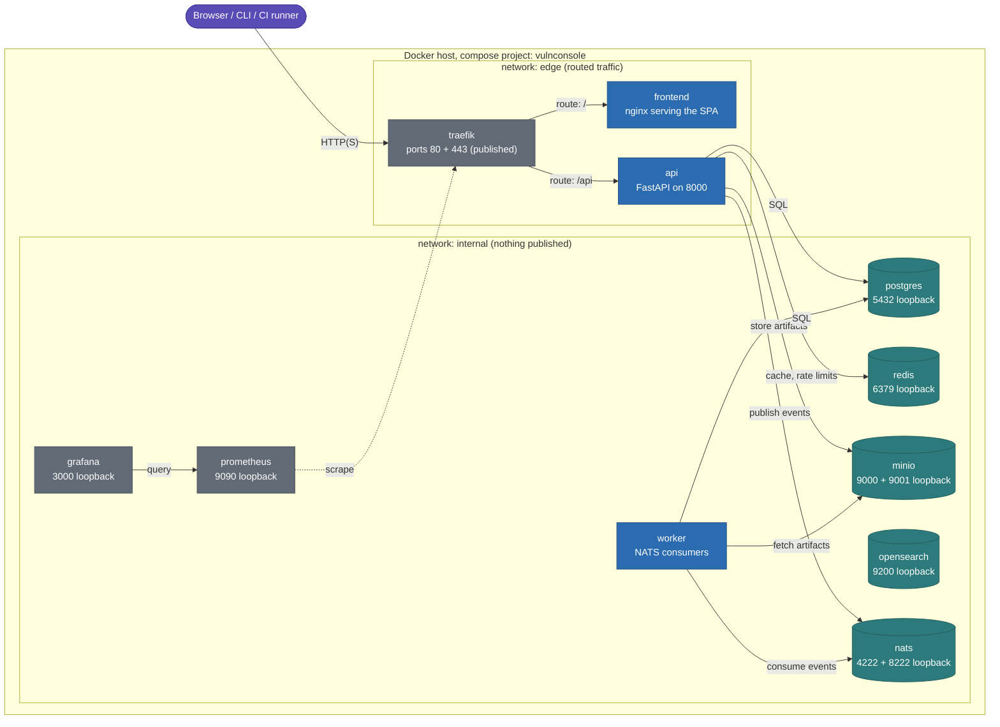
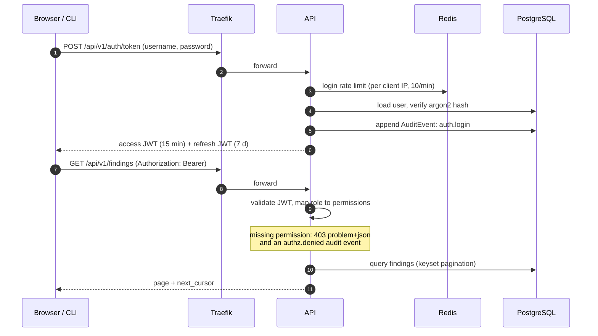
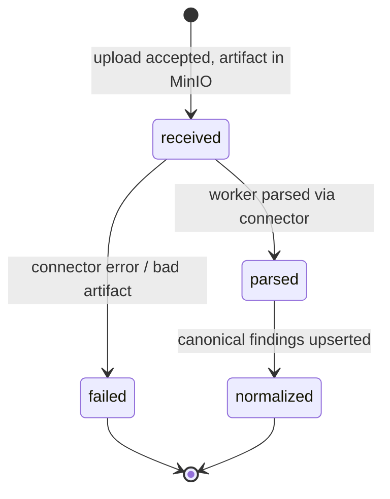

# Architecture Diagrams

Index of every diagram in the documentation set, plus the deployment and runtime diagrams that did not fit elsewhere. All diagrams are Mermaid and render on GitHub.

| Diagram | Where |
|---------|-------|
| C4 level 1: system context | [overview.md](overview.md) |
| C4 level 2: containers | [overview.md](overview.md) |
| Finding pipeline (sequence) | [overview.md](overview.md) |
| ER diagram (domain model) | [domain-model.md](domain-model.md) |
| Finding lifecycle (state) | [domain-model.md](domain-model.md) |
| Bounded-context dependency graph | [service-decomposition.md](service-decomposition.md) |
| Trust boundaries | [../security/threat-model.md](../security/threat-model.md) |
| Deployment topology (Compose) | below |
| Authentication flow | below |
| Scan status lifecycle | below |

## Deployment topology (Docker Compose, Milestone 1)

Only Traefik publishes ports to the network; every admin and data port binds to loopback. The `edge` network carries routed traffic, the `internal` network everything else.

Color key: blue = application containers, teal = stateful data stores, gray = edge and observability. "loopback" means the port is reachable only from the host machine itself.

Startup ordering: `api` waits for postgres/redis/nats/minio health, runs `alembic upgrade head`, optionally seeds the admin user, then serves; its own healthcheck is `/readyz`. `worker` starts only after `api` reports healthy, so the schema always exists before consumers run.

## Authentication and authorization flow

CI ingestion tokens (`vc_` prefix) travel through the same header, resolve against a hashed token table, and carry only `scans:ingest`; they can never read findings.

## Scan status lifecycle (implemented in M1)

Each transition is committed before the next pipeline event publishes, and every stage is idempotent: re-delivery of `ingestion.scan.received` re-parses cleanly, re-delivery of `ingestion.scan.parsed` skips raw findings that already link to a canonical finding.
