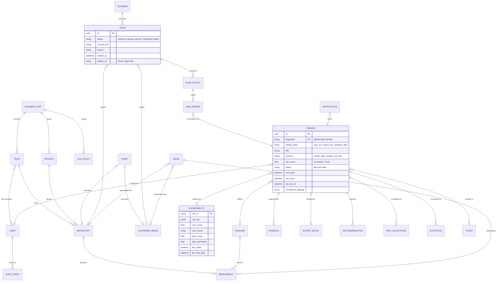
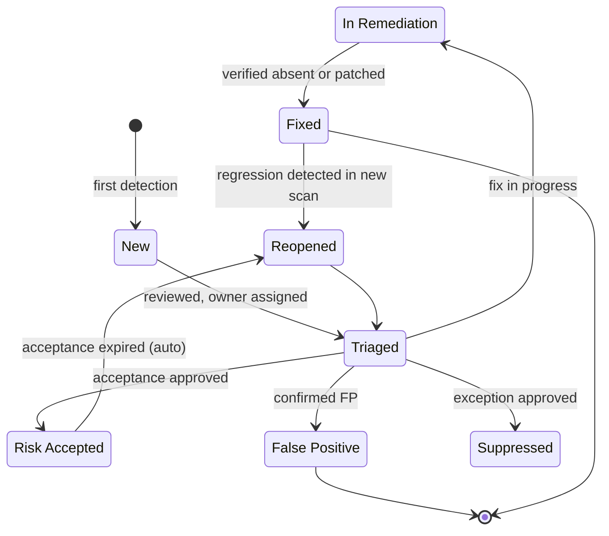

# Domain Model

## Entity catalog

| Entity | Owning context | Description |
|--------|----------------|-------------|
| BusinessUnit | Identity & Access | Organizational grouping; scopes SLA policies and scorecards |
| Team | Identity & Access | Owns repositories; members are users |
| User | Identity & Access | Human or service account; holds roles |
| AuditEvent | Identity & Access | Immutable record of every state-changing action |
| Project | Inventory | Logical product grouping of repositories |
| Repository | Inventory | Source repository; carries criticality and exposure (internet-facing) flags |
| Asset | Inventory | Deployable/attackable thing; points at a repository or container image, carries business criticality |
| Package | Inventory | Unique package identity (purl) |
| Dependency | Inventory | Edge: repository (or SBOM) uses package at version |
| SBOM | Inventory | Imported CycloneDX/SPDX document; source of dependency edges |
| ContainerImage | Inventory | Image identity by digest |
| Scanner | Ingestion | Registered tool (Semgrep, Trivy, ...) with connector binding |
| Scan | Ingestion | One execution/upload of a scanner against a target |
| ScanResult | Ingestion | Parsed artifact of a scan; links to raw artifact in MinIO |
| RawFinding | Ingestion | Scanner-native finding, preserved verbatim (JSONB) |
| Finding | Normalization & Correlation | Canonical, deduplicated finding; identity = fingerprint |
| Vulnerability | Enrichment | CVE-keyed intelligence: CWE list, CVSS, EPSS, KEV flag, references |
| SecretDetail | Normalization & Correlation | Extra fields for secret findings (rule, hashed value, validity check result); evidence is RBAC-gated |
| Evidence | Normalization & Correlation | Supporting data for a finding: snippet, trace, match, provenance |
| RiskAcceptance | Triage & Workflow | Approved acceptance with justification, approver, expiry |
| Exception | Triage & Workflow | Policy exception (e.g. suppression) with mandatory expiry |
| SlaPolicy | Risk & Prioritization | Time-to-remediate targets per severity band, scoped to business unit |
| Recommendation | Remediation | Concrete fix guidance: patch, upgrade path, code change, compensating control |
| Ticket | Notifications & Integrations | External tracker reference (Jira, GitHub/GitLab issue) |
| Notification | Notifications & Integrations | Dispatched message record (Slack, Teams, email, webhook) |

## ER diagram



Attribute blocks are shown only for the three pivotal entities; full column definitions arrive with the Alembic migrations in Milestone 1.

## Raw vs canonical findings

The load-bearing design decision (ADR-0007): scanner output is never the system of record for triage.

- **RawFinding** preserves scanner output verbatim (JSONB). Nothing is lost; scanner disagreements remain inspectable and re-normalization is always possible.
- **Finding** is the canonical, deduplicated unit that all workflow, scoring, and reporting attach to. Many raw findings from many scanners map onto one canonical finding via the fingerprint.

### Fingerprint (v2, implemented)

```
fingerprint = sha256(
    "v2"
  + finding_class            # sast | sca | secret | iac | container | dast
  + rule_key                 # class-specific, see below
  + asset_key                # repository full name
  + location_key             # class-specific, see below
)
```

Identity per class (`derive_identity` in `normalization/domain/fingerprint.py`):

- **sca / container**: rule = the vulnerability id (CVE/GHSA, uppercased), location = the versionless purl (fallback: package name, then path). Trivy and Grype reporting the same CVE in the same package produce the same fingerprint, and upgrading the package does not mint a new finding.
- **secret**: rule = the constant `secret`, location = file path + sha256 of the secret value. Gitleaks and TruffleHog finding the same credential in the same file correlate regardless of rule naming; the same credential in two files stays two findings. Secret values are hashed and redacted inside the connector; plaintext never reaches storage.
- **cloud**: rule = the check id (e.g. `s3_bucket_public_access`), location = the resource uid/ARN. Prowler findings for AWS and Azure land in one `cloud` view, and the same failing control on the same resource correlates across re-scans. PASS results are not ingested.
- **sast / iac**: rule = tool-namespaced rule id, location = file path. Context hashing to survive line drift is a future fingerprint version.

Connectors supply the class-specific inputs as `hints` on each raw finding (standard keys: `vuln_id`, `purl_base`, `package`, `installed_version`, `fixed_version`, `secret_hash`).

## Finding lifecycle



Rules enforced by the state machine (implemented in `normalization/domain/triage.py`; the workflow lives on the Finding aggregate alongside its existing `status`):

- Legal transitions only: closed dispositions (fixed, risk_accepted, false_positive, suppressed) can go only to reopened; open states can move to any working disposition. Illegal moves are rejected with a problem+json 422.
- Every transition requires a justification; it writes an AuditEvent (who, when, from, to, reason) and publishes `triage.finding.status_changed`. Notable dispositions (risk_accepted, false_positive, suppressed, reopened) notify configured channels.
- Risk acceptance requires a future expiry; a periodic worker loop auto-reopens accepted findings once the expiry passes (actor `system:expiry`) and clears the SLA breach flag so the clock resumes.
- Full exception entities (approval workflow, listing) and scan-absence-based auto-fix remain future work.
