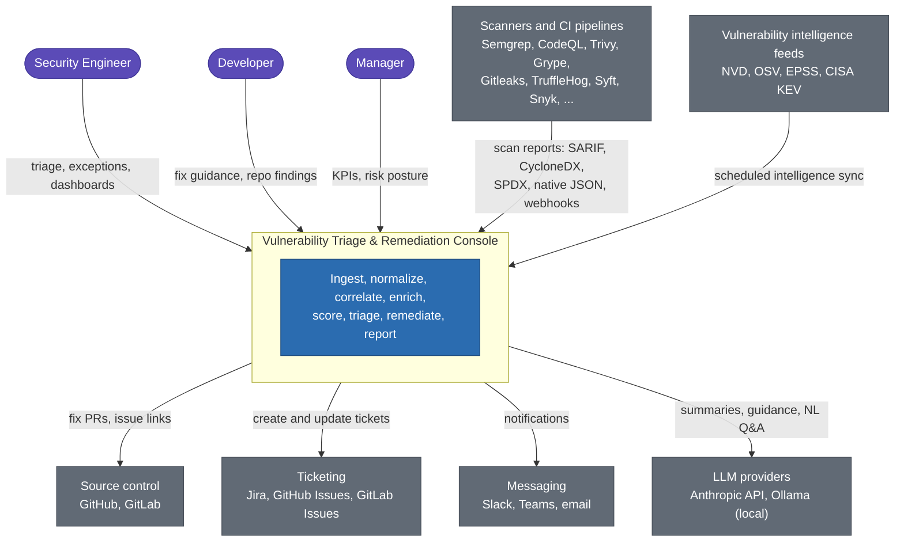
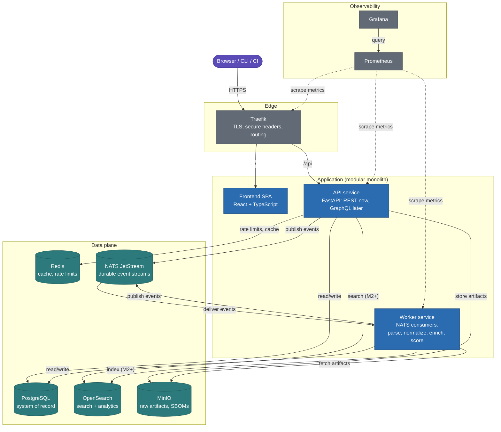
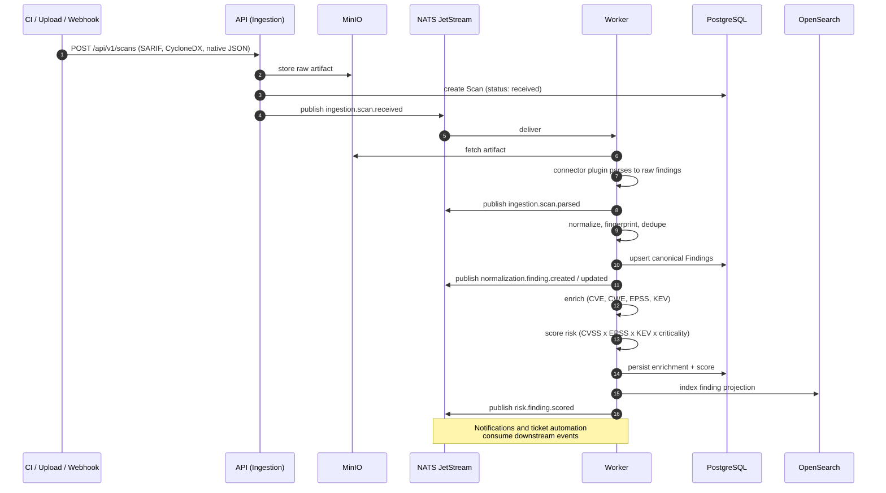

# Architecture Overview

## Vision

A centralized platform that turns raw, noisy scanner output into prioritized, evidence-backed, actionable security work. The console is the single pane of glass for application security findings across a homelab (and later, an enterprise) estate.

## Goals

1. Reduce alert fatigue: one canonical finding per real issue, regardless of how many scanners report it.
2. Prioritize by real risk: exploitability (EPSS, KEV), severity (CVSS), asset criticality, and reachability, not raw severity alone.
3. Make remediation cheap: concrete fix guidance, dependency upgrade paths, and eventually automated fix PRs.
4. Keep humans accountable: triage workflows, exceptions with expiry, ownership, SLAs, and a complete audit trail.

## Architectural principles

- **Modular monolith first** (ADR-0002): one codebase, strict bounded contexts, two deployable processes (API + worker). Contexts communicate through NATS events and application-service interfaces only, never through each other's domain internals. This makes later extraction into microservices a packaging exercise, not a rewrite.
- **Event-driven pipeline**: ingestion, normalization, enrichment, scoring, and notification are asynchronous stages connected by durable JetStream streams. Each stage is idempotent and replayable.
- **API-first**: every capability is exposed through the versioned REST API before any UI is built on it. The frontend is just another API client.
- **Plugin extensibility**: scanner connectors are plugins behind a stable protocol (ADR-0008). Adding a scanner never modifies core code.
- **Secure by design**: the platform stores vulnerability data and real secrets found by scanners. It is itself a high-value target and is threat modeled accordingly (docs/security/threat-model.md).

## System context (C4 level 1)

Color key: purple = people, blue = this platform, gray = external systems.

## Container view (C4 level 2)

Color key: blue = application code, teal = data stores, gray = edge and observability.

The API and worker are the same codebase with different composition roots (`platform/api`, `platform/worker`). Both load the bounded contexts under `backend/src/vulnconsole/contexts/`; the API mounts their routers, the worker subscribes their event handlers.

## The finding pipeline

The core data flow, from scanner output to actionable finding:

Every stage is idempotent: replaying `ingestion.scan.received` re-parses without duplicating findings, because canonical identity is the deterministic fingerprint (ADR-0007).

## Deployment view

- **Now (M0+)**: single Docker Compose stack. Infrastructure services in `deploy/compose/docker-compose.yml`; API, worker, and frontend containers join the stack in Milestone 1.
- **Later (M8)**: Kubernetes manifests/Helm chart. The monolith's contexts can be split into separately scaled deployments (worker per pipeline stage) without code changes because all cross-context communication already flows through NATS.

## Related documents

- Technology choices and rationale: [tech-stack.md](tech-stack.md)
- Bounded contexts and events: [service-decomposition.md](service-decomposition.md)
- Entities and lifecycle: [domain-model.md](domain-model.md)
- Decision records: [../adr/](../adr/)
