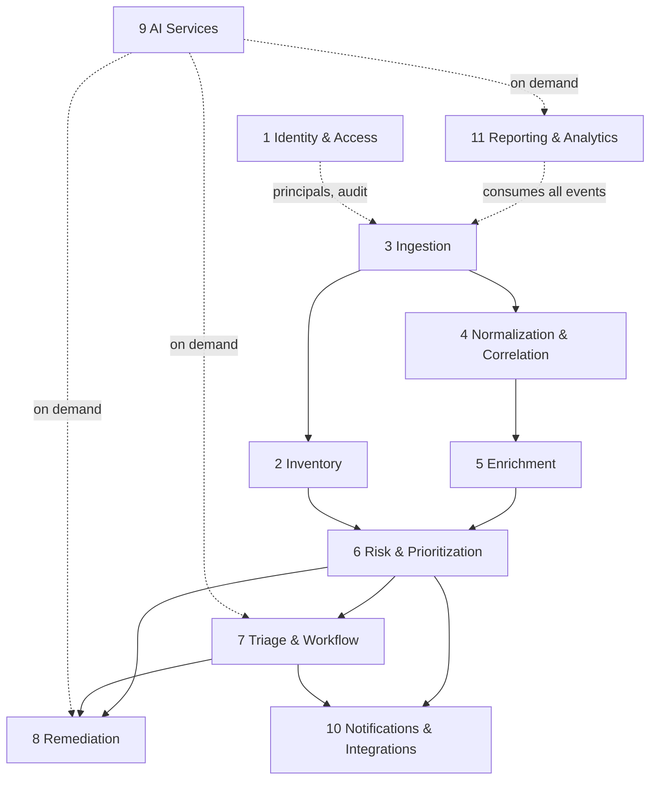

# Service Decomposition

The platform is a modular monolith (ADR-0002) of 11 bounded contexts. Each context lives under `backend/src/vulnconsole/contexts/<name>/` with internal layers `domain/`, `application/`, `infrastructure/`, `api/`. Contexts never import another context's `domain` or `infrastructure`; cross-context collaboration happens through NATS events or another context's `application` interface.

## Bounded contexts

| # | Context | Package | Responsibility | Publishes | Consumes |
|---|---------|---------|----------------|-----------|----------|
| 1 | Identity & Access | `identity` | Users, teams, business units, roles, API tokens, audit log | `identity.audit.recorded` | (none) |
| 2 | Inventory | `inventory` | Repositories, projects, assets, packages, dependencies, SBOMs, container images, criticality | `inventory.sbom.imported`, `inventory.asset.updated` | `ingestion.scan.parsed` |
| 3 | Ingestion | `ingestion` | Connector plugin registry, upload API, webhook receivers, raw artifact storage, Scan lifecycle | `ingestion.scan.received`, `ingestion.scan.parsed`, `ingestion.scan.failed` | (self-driven) |
| 4 | Normalization & Correlation | `normalization` | Canonical Finding model, fingerprinting, dedup, cross-scanner correlation | `normalization.finding.created`, `normalization.finding.updated`, `normalization.finding.resolved` | `ingestion.scan.parsed` |
| 5 | Enrichment | `enrichment` | NVD/OSV CVE data, CWE, EPSS, KEV feed sync and matching | `enrichment.finding.enriched`, `enrichment.feed.synced` | `normalization.finding.created` |
| 6 | Risk & Prioritization | `risk` | Composite risk scoring, SLA policies, due dates, breach detection | `risk.finding.scored`, `risk.sla.breached` | `enrichment.finding.enriched`, `inventory.asset.updated` |
| 7 | Triage & Workflow | `triage` | Lifecycle transitions, FP workflow, risk acceptance, exceptions with expiry, ownership | `triage.finding.status_changed`, `triage.exception.created`, `triage.exception.expired` | `risk.finding.scored`, `normalization.finding.resolved` |
| 8 | Remediation | `remediation` | Recommendations, upgrade paths, fix PR generation, compensating controls, suppression management | `remediation.recommendation.created`, `remediation.fix_pr.opened` | `risk.finding.scored`, `triage.finding.status_changed` |
| 9 | AI Services | `ai` | LLM provider abstraction, summaries, exploitability explanations, NL Q&A, clustering | `ai.summary.generated` | on-demand via application interface |
| 10 | Notifications & Integrations | `notifications` | Slack/Teams/email dispatch, Jira/GitHub/GitLab tickets, outbound webhooks | `notifications.message.dispatched`, `notifications.ticket.created` | `risk.sla.breached`, `triage.*`, `risk.finding.scored` |
| 11 | Reporting & Analytics | `reporting` | OpenSearch projections, dashboards, KPIs, MTTR, trends | (none) | all domain events (projection builder) |

Shared kernel (`shared/`): event envelope and publishing, configuration, database session management, result types, pagination primitives, authenticated-principal type. Kept deliberately small; anything context-specific does not belong there.

Composition roots (`platform/`): `api` (FastAPI app mounting each context's routers), `worker` (NATS consumers registering each context's handlers), `cli` (operational commands). These are the only modules that import across all contexts.

## Context dependency graph

Arrows mean "depends on events or interfaces of". The pipeline flows top to bottom; foundational contexts are referenced by identifier only (foreign keys), not imports.



## Event catalog

Envelope (every event):

```json
{
  "event_id": "uuid7",
  "subject": "normalization.finding.created",
  "occurred_at": "2026-07-02T12:00:00Z",
  "actor": "system | user:<id> | token:<id>",
  "correlation_id": "uuid of the originating scan or request",
  "payload": { }
}
```

Subject convention: `<context>.<entity>.<past_tense_event>`. Payloads carry identifiers plus the minimal changed state; consumers fetch full aggregates through application interfaces when needed (thin events, fat reads).

### JetStream streams

| Stream | Subjects | Retention |
|--------|----------|-----------|
| INGESTION | `ingestion.>` | 7 days (raw artifacts persist in MinIO regardless) |
| FINDINGS | `normalization.>`, `enrichment.>`, `risk.>` | 30 days, replayable for projection rebuilds |
| WORKFLOW | `triage.>`, `remediation.>` | 90 days |
| OUTBOUND | `notifications.>`, `ai.>` | 7 days |
| AUDIT | `identity.audit.>` | mirrored to PostgreSQL append-only table; stream is transport, not storage |

## Extraction path (monolith to services)

When scale demands it (not before), a context is extracted by:

1. Moving its package into its own deployable with the same `domain/application/infrastructure/api` layout.
2. Pointing it at its own schema (already namespaced per context in PostgreSQL).
3. Keeping its NATS subjects unchanged: publishers and consumers are location-transparent already.
4. Replacing any in-process application-interface calls with the context's REST API (these call sites are explicit and few by design).

Likely first extractions: Ingestion workers (CPU-bound parsing, scale independently) and AI Services (different resource and secret profile).
