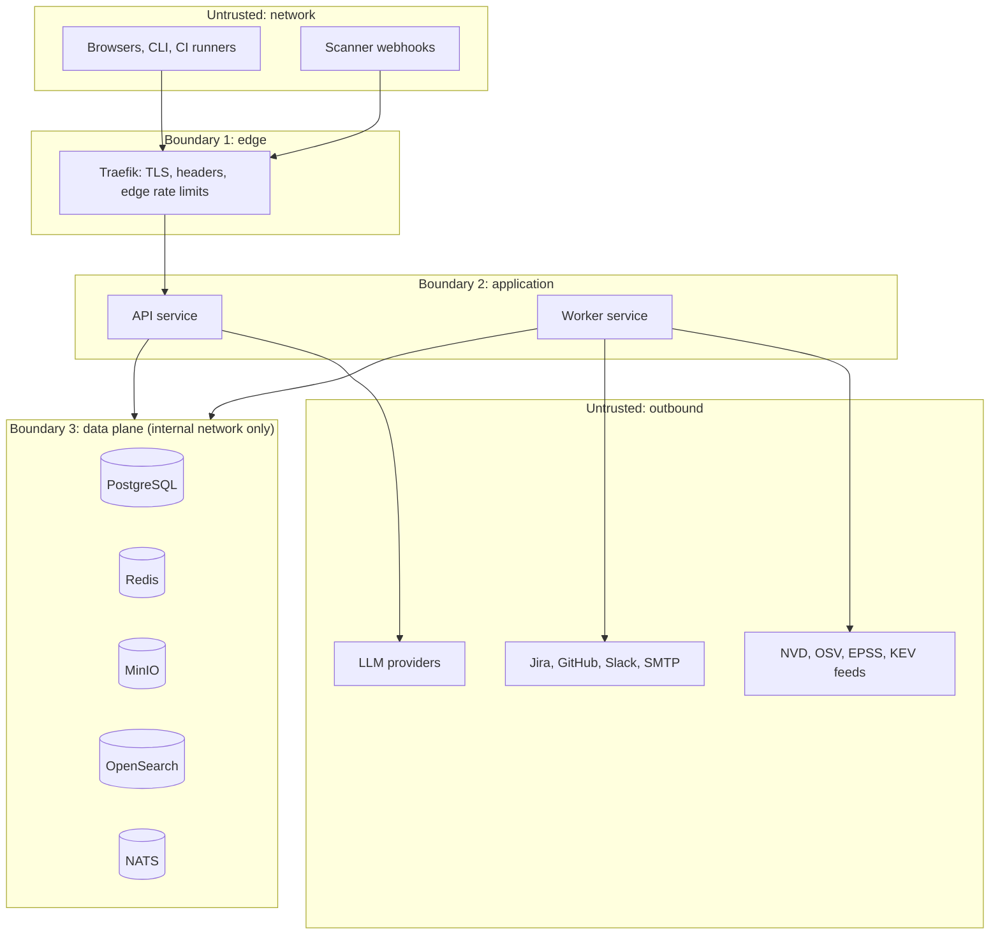

# Threat Model (STRIDE)

The console aggregates an estate's vulnerability posture and stores real secrets discovered by scanners. Compromise of the platform is worse than compromise of most systems it watches: it is a target map plus credentials. This document models the platform itself; it is revisited at every milestone.

## Assets worth stealing or tampering with

1. Secret findings (actual leaked credentials found by Gitleaks/TruffleHog)
2. The vulnerability map (which assets are exploitable, where, and how)
3. Triage integrity (an attacker who can mark findings False Positive silences defense)
4. Ingestion tokens (write access to the source of truth)
5. Audit log (covering tracks)
6. LLM provider keys and outbound integration credentials (Jira, GitHub, Slack)

## Trust boundaries

Boundary rules:

- Only Traefik is network-exposed; every data-plane service binds to the internal Compose network and loopback.
- Uploaded artifacts are untrusted input even though they arrive authenticated: CI tokens can be stolen.
- Feed responses are untrusted input: enrichment parsers validate schema and size.
- Everything sent to a hosted LLM leaves the trust boundary: redaction is mandatory (ADR-0010).

## STRIDE by component

| Component | Threat | Example | Mitigation (milestone) |
|-----------|--------|---------|------------------------|
| Edge / API | Spoofing | Stolen CI token used to poison findings | Short-lived JWTs, hashed revocable API tokens, ingestion-scoped by default (M1); token rotation guidance (M4) |
| API | Tampering | Forged severity downgrade, unauthorized FP transition | RBAC on transitions, server-side validation, signed audit trail (M1, M4) |
| API | Repudiation | Analyst denies approving a risk acceptance | Append-only AuditEvent for every state change with actor and justification (M1) |
| API / DB | Information disclosure | Secret evidence readable by any viewer | Secret values encrypted at rest (application-level), redacted by default, dedicated permission + audit on reveal (M2) |
| API | Denial of service | 5 GB SARIF upload, zip bombs, JSON depth attacks | Size caps, streaming parsers, depth limits, rate limits at edge and app (M1, M2) |
| API | Elevation of privilege | Viewer escalates via mass-assignment on user update | Explicit Pydantic request models, no ORM-model binding, RBAC tests per endpoint (M1) |
| Ingestion parsers | Tampering / DoS | Malicious artifact exploits parser (XXE in SPDX XML, pathological regex) | XML external entities disabled globally, format sniffing, parser fuzz corpus in CI, connectors run in the worker not the API process (M2) |
| Enrichment | Tampering | Poisoned feed mirror alters CVSS/EPSS data | HTTPS pinned hosts, schema validation, anomaly logging on large diffs (M3) |
| NATS | Spoofing / Tampering | Rogue local process publishes fake events | NATS auth token + subject permissions; internal network only (M1) |
| PostgreSQL / MinIO | Information disclosure | Backup or volume theft | Encrypted volumes at the host layer, encrypted offsite backups, documented in operator guide (M4) |
| AI layer | Information disclosure | Secrets embedded in prompts to hosted LLM | Structural redaction pre-send; local-only mode for secret-adjacent tasks (M6) |
| AI layer | Tampering (prompt injection) | Finding content crafted to steer AI remediation advice | Findings treated as data in prompts, output schemas validated, AI suggestions never auto-applied without human approval (M6) |
| Outbound integrations | EoP | Jira/GitHub tokens over-scoped | Least-privilege scopes documented per integration, stored via secrets management, never in DB plaintext (M5) |
| Frontend | Tampering (XSS) | Finding titles/evidence contain script from scanner output | Strict CSP via Traefik headers, React escaping, no dangerouslySetInnerHTML, evidence rendered as text (M1) |
| Frontend | CSRF | State change from hostile origin | Bearer-token auth (no ambient cookies); if cookies are ever introduced, SameSite plus CSRF tokens (M1) |

## Homelab deviations (accepted, tracked)

These are deliberate M0 gaps, each with an exit plan:

| Deviation | Risk | Exit |
|-----------|------|------|
| OpenSearch security plugin disabled | Unauthenticated cluster on internal network | Enable plugin + TLS when multi-user (M8) |
| No TLS between internal services | Lateral movement reads traffic | mTLS or network policies in Kubernetes (M8) |
| Grafana/MinIO/Prometheus admin UIs on loopback with default-style credentials in .env | Weak local auth | Credentials required at first `.env` creation; SSO fronting later (M4+) |
| Secrets in `.env` files | File theft exposes credentials | Vault or SOPS-encrypted config (M8) |

## Platform security requirements checklist

Requirement to milestone mapping: RBAC (M1 basic, M4 full), SSO/MFA readiness (M4), JWT + OAuth2 (M1), audit logs (M1), immutable audit storage (M4), encryption in transit at edge (M0 Traefik TLS), encryption at rest for secret evidence (M2), secrets management (M8), rate limiting (M1), secure headers + CSP (M0 Traefik config), CSRF protection (M1), input validation (M1, every boundary), secure file uploads (M1-M2).
